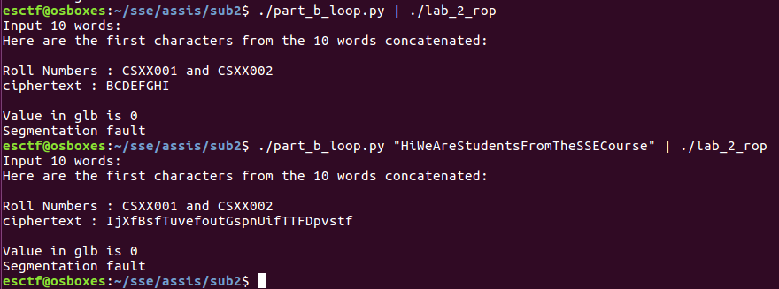
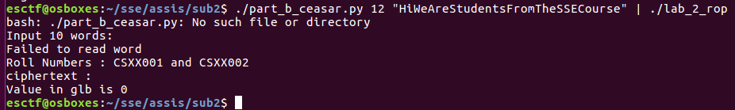

# CS6570 Assignment 2

## ME19B177 and EE18B110

- The output of the python script should be piped to the input of the binary.
- To run it in GDB, you must first pipe the output to a file, and pipe it to the binary with the ``run`` command.

## Part A:

Exploit generator: [part_a.py](part_a.py)

```bash
./part_a.py | ./lab_2_rop
```


## Part B:

### Increment each letter by 1
Exploit generator: [part_b_loop.py](part_b_loop.py)  

Loops through the plaintext until a '\n' is reached.
Each byte is loaded, incremented, and stored again.

```bash
./part_b_loop.py "ThisIsTheSecret"| ./lab_2_rop
```



### Caesar Cipher Attempt
Exploit generator: [part_b_caesar.py](part_b_caesar.py)  

We were unable to make the loop work with the cipher shell code instead of the increment instruction.

```bash
./part_b_caesar.py 12 "ThisIsTheSecret"| ./lab_2_rop
```

