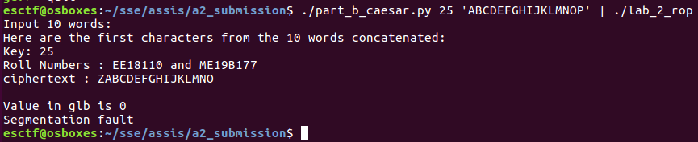

# CS6570 Assignment 2

## ME19B177 and EE18B110

- The output of the python script should be piped to the input of the binary.
- To run it in GDB, you must first pipe the output to a file, and pipe it to the binary with the ``run`` command.

## Part A:

Exploit generator: [part_a.py](part_a.py)

```bash
./part_a.py | ./lab_2_rop

```


## Part B:

Exploit generator: [part_b_caesar.py](part_b.py)

```bash
./part_b_caesar.py 25 'ABCDEFGHIJKLMNOP' | ./lab_2_rop
```



## Reason for Late Submission

Before the deadline, we had the loop and the encryption ROP chains running separately.
We had the loop running a dummy 'inc_eax' encryption step and the encryption code ran on a single character.
We attempted to combine the two, but there were some bugs in the integration.
We submitted both of these files on the deadline.

During the VIVA (Tuesday, 7pm) we asked if it was possible for us to work out the bugs in combining the loop and
encryption and submit that again.
After that, we worked at night and got it entire code running correctly. This is the submission of the final solution to
the part B. Both chains of instructions were ready on the deadline, but we were unable to combine them correctly.
We worked after the VIVA to get that done, and hence this submission this morning.

